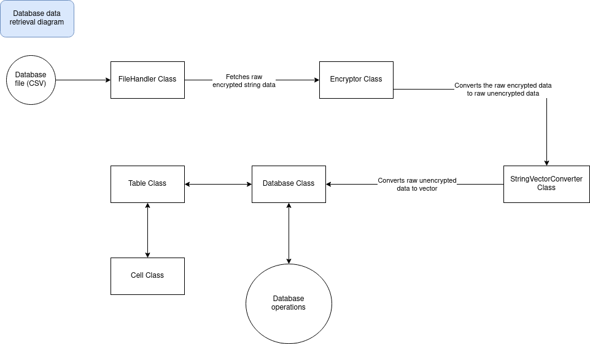

# PicoDB
 (proposed)


PicoDB is a lightweight SQL simulation library built in C++ that uses CSV files to store and manage data. It supports basic SQL operations, allowing users to interact with data as if using a traditional SQL database, while leveraging CSV as the underlying storage mechanism.

---

## Features

- **Data Storage with CSV**: Simulates SQL databases using CSV files to store data.


- **Encryption**: Supports XOR cipher for basic encryption of data.


- **Basic SQL Operations**:

  - **SELECT, INSERT, UPDATE, DELETE**: Perform standard SQL operations.

  - **CREATE, ALTER, DROP TABLE**: Manage table schemas.

  - **JOIN Operations**: Basic INNER JOIN support.

  - **Primary & Foreign Keys**: Define relationships between tables.

  - **Filtering**: WHERE clauses.

  - **Functions**: String, numeric, and date functions.

  - **Sub-Queries**: Nested SELECT statements.

## Requirements
- C++17 or higher
- CMake (for building the project)
- A C++ compiler like GCC or Clang


## Getting Started
1. Clone the Repository

Clone the PicoDB repository to your local machine:

```bash
git clone https://github.com/yourusername/PicoDB.git
cd PicoDB
```

2. Build the library

You will need to use CMake to build the library.

```bash
mkdir build
cd build
cmake ..
make
```

This will compile the project into a static library (libpicoDB.a) in the build/lib directory.

3. Using PicoDB in Your Project

After building and installing the library, you can use PicoDB in your own C++ projects.

Here’s how you can link it to your project using CMake:

```cmake
# In your project's CMakeLists.txt
find_package(PicoDB REQUIRED PATHS "/path/to/picodb/install")

add_executable(your_project main.cpp)
target_link_libraries(your_project picoDB)
```

4. Running Examples

PicoDB includes some example usage. To try them out, you can create a simple test file:

```cpp
#include "PicoDB/PicoDB.h"

int main() {
    // Initialize PicoDB with database name, path, username, and encryption key
    PicoDB db("studentdb", "./db_data", "admin", "admin");

    // Create a table
    db.createTable("students", {{"id", "INT", "PRIMARY_KEY"}, {"name", "STRING"}, {"age", "INT"}});

    // Insert some data
    db.insertInto("students", {"id", "name", "age"}, {"1", "John Doe", "20"});

    // Query the data
    auto result = db.select("students", {"id", "name", "age"}, "age > 18");
    db.printTable(result);

    return 0;
}
```

## Using PicoDB

1. **Create a database**:

    ```cpp
    Database db("studentdb", "/path/to/csv/files/", true); // true for encryption
    ```

2. **Create a table**:

    ```sql
    CREATE TABLE students (id INT, name VARCHAR, age INT);
    ```

3. **Insert data**:

    ```sql
    INSERT INTO students (id, name, age) VALUES (1, 'John Doe', 20);
    ```

4. **Query data**:

    ```sql
    SELECT * FROM students WHERE age > 18;
    ```

### Advanced Usage

- **Joins**: Perform inner joins to combine tables on a common key.

    ```sql
    SELECT students.name, courses.name
    FROM students
    INNER JOIN courses ON students.id = courses.student_id;
    ```

## Project Structure

Here is the proposed basic Project Structure. We are planning to update it over time.

```plaintext
/picoDB/
├── CMakeLists.txt      	# CMake build configuration
├── include/            	# Public headers
├── src/                	# Library implementation
├── test/               	# Unit tests
├── examples/           	# Example usage
├── docs/               	# Documentation
└── README.md           	# Project overview
 ```

## Here is the draw.io diagram for our project (rough)

